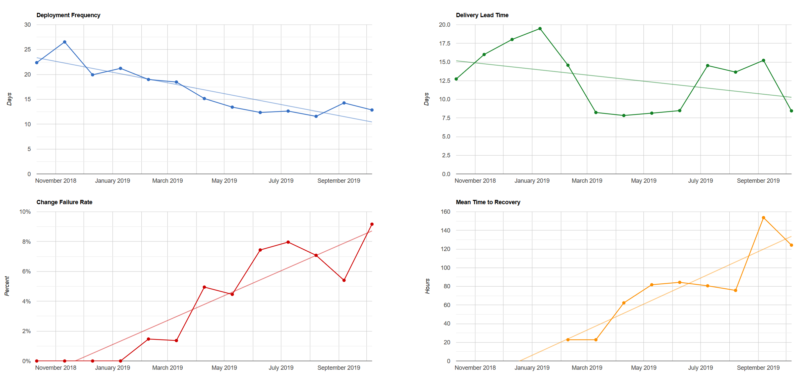

# RedGate.Metrics
Metric generation used at Redgate Software

## Four Key Metrics
The State of DevOps reports have focused on data-driven and statistical analysis of high-performing organizations. The result of this multi-year research, published in the book "Accelerate", demonstrates a direct link between organizational performance and software delivery performance.

The researchers have determined that four key metrics differentiate between low, medium and high performers: delivery lead time, deployment frequency, mean time to restore (MTTR) and change fail percentage.

We aim to use these metrics at Redgate to help us focus on measuring and improving what matters.

If you'd like to know more, see our blog at [ingeniouslysimple.com](https://medium.com/ingeniouslysimple/learning-from-the-accelerate-four-key-metrics-91725675e30a).

## Implementation
We use the historical data stored in our `git` repositories to provide sufficiently-accurate measures for these metrics.

## Requirements
This code should run with any recent version of `PowerShell` or `PowerShell Core`. This should include running on non-Windows hosts.

You'll need the `git` commandline tools available, and the repository/s you want to analyse.

## Usage
### Simple Report Generation
There's a helper method available to create a simple report for a single-product repository:

`Invoke-FourKeyMetricsReportGeneration`

The `Publish-FourKeyMetricsReport` method is specific to Redgate's infrastructure, but is optional and easily skipped by not providing suitable credentials.

### Complex Report Generation
When reporting on the combination of multiple products, we need to do a little more work:
* Generate the release metrics for each product using `Get-ReleaseMetricsForCheckout`
* Combine those release metrics into a single list
* Calculate average metrics for that single list using `Get-AverageReleaseMetrics`
* Create an HTML report using `New-FourKeyMetricsReport`

## What is a "fix release"?

A fix release is a release whose primary purpose is to correct a serious bug or issue encountered in production. We assume this issue was introduced in the previous release to production.

A fix release may include other changes, but these should always be of a releasable quality.

Typically a fix release will be unplanned, to get the fix to customers as promptly as possible.

## Git Conventions

There are some conventions we need to follow with our use of git to allow accurate generation of metrics.

### Releases must use annotated tags
Git has two different types of tags - annotated and lightweight.

To analyse a repository successfully, releases must use annotated tags.

Existing lightweight tags can be replaced with annotated tags if necessary.

### Releases must be identifiable
We must be able to identify release tags in the repository.

This can be done with any accurate `fnmatch` expression, although a local convention will make this much easier.

For simplicity, the following convention is recommended:

    releases/[version-number]

Where multiple products are released from the same repo, a per-product convention should be adopted:

    releases/[product-ident]/[version-number]

### Fix Releases must be identifiable

To identify change/fail rates and MTTR, we rely on recording when we recover from failure. That means tagging a "fix" release in a way we can identify.

For simplicity, the following convention is recommended:

    [release-tag]/fix

## Developer Information

Tests can be run by executing `FourKeyMetrics.Tests.ps1`. This will require `Pester`.

This code wasn't test-driven, so coverage is patchy. All future work should be test-driven, including refactoring and bug-fixing.
